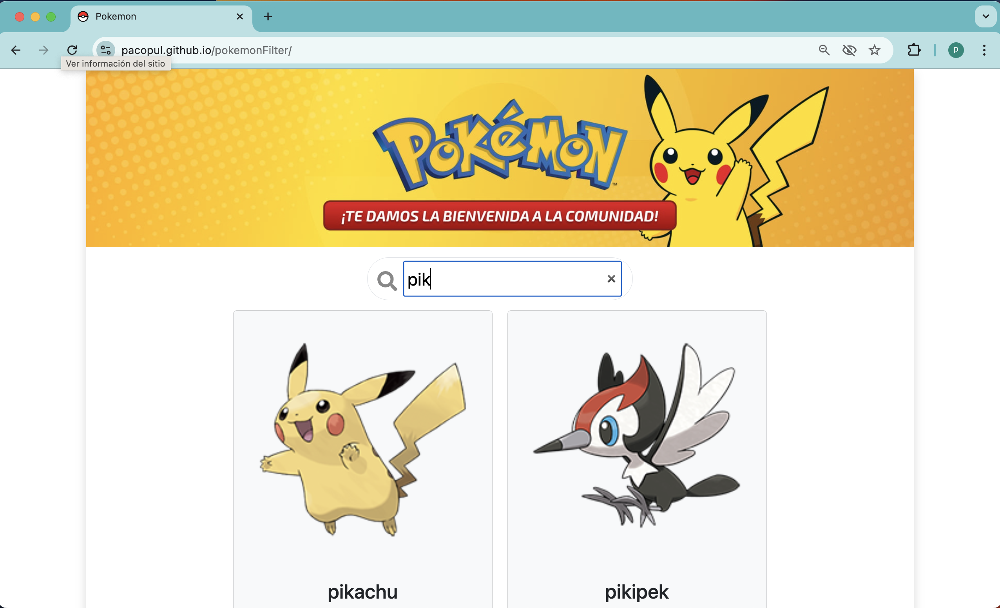

**Component Search para filtrar un lista de elementos**

1. Primeramente vamos a construir un nuevo componente llamado Search
```
import React from "react";

const Search = () => {
  // funcionalidad
  return (
    // contenido
    <div></div>;
  );
};

export default Search;
```

2. Este componente va a recibir en su parámetro una función; que será la encargada de dar el valor de la query a la función enviada por el padre de este componente para realizar el filtro. Recordemos que los datos los tendrá el componente superior (App) y necesitará la query (e.target.value) del hijo (Search) para filtrar.

En el Padre \<Search onSearch={handleSearch} /> hace que cuando se ejecute en el hijo onSearch(e.target.value) hace que handleSearch en el padre se ejecute y tenga la query en su argumento:

const handleSearch = (query) => {...}

```
const Search = ({ onSearch }) => {

  const handleInputChange = (e) => {
    onSearch(e.target.value);
  };

  return (
    <input
      type="search"
      placeholder="Buscar..."
      onChange={handleInputChange}
    />
  );
};

export default Search;
```
3. Ahora que ya tenemos este nuevo componente para que el usuario teclee su búsqueda; es hora de llamarlo desde el componente superior (App.jsx):

\<Search onSearch={handleSearch} />

4. Ahora toca definir esta función handleSearch:
```
import Search from './components/Search';
const App = () => {
 const [pokemons, setPokemons] = useState([]);
 const [filteredPokemons, setFilteredPokemons] = useState([]);
   useEffect(() => {
   fetchPokemons()
     .then(pokemons => {
       setPokemons(pokemons);
       setFilteredPokemons(pokemons);
     })
     .catch((err) => {
       console.log(err.message);
     });
 }, []);
   // función se pasa a Search para recibir query y filtrar
 const handleSearch = (query) => {
   if (!query) {
     setFilteredPokemons(pokemons);
   } else {
     setFilteredPokemons(
       pokemons.filter(pokemon =>
         pokemon.name.toLowerCase().startsWith(
           query.toLowerCase())
       )
     );
   }
 };
```

Observamos que ahora utilizamos dos variables de estado para almacenar los pokemons. Una con todos los pokemons y otra con los filtrados; que serán estos últimos los que utilizaremos en la vista.

Y la función que le pasamos al componente, que recordamos que recibía la query, se encarga de filtrar. Si no hay query los sacamos todos y si hay los filtramos.

Nuestra vista App junto con el nuevo componente cambia:
```
     <div className="row justify-content-center pt-3">
       <div className="col-3">
         <Search onSearch={handleSearch} />
       </div>
     </div>
     <div class="row p-3 justify-content-center">
       {filteredPokemons.map((pokemon) => (
         <div class="col-md-6 col-lg-4 mb-3">
           <PokemonCard 
              key={pokemon.name} 
              name={pokemon.name} 
              url={pokemon.url} />
         </div>
       ))}
     </div>
```
El resultado final en la web de pokemon es:


